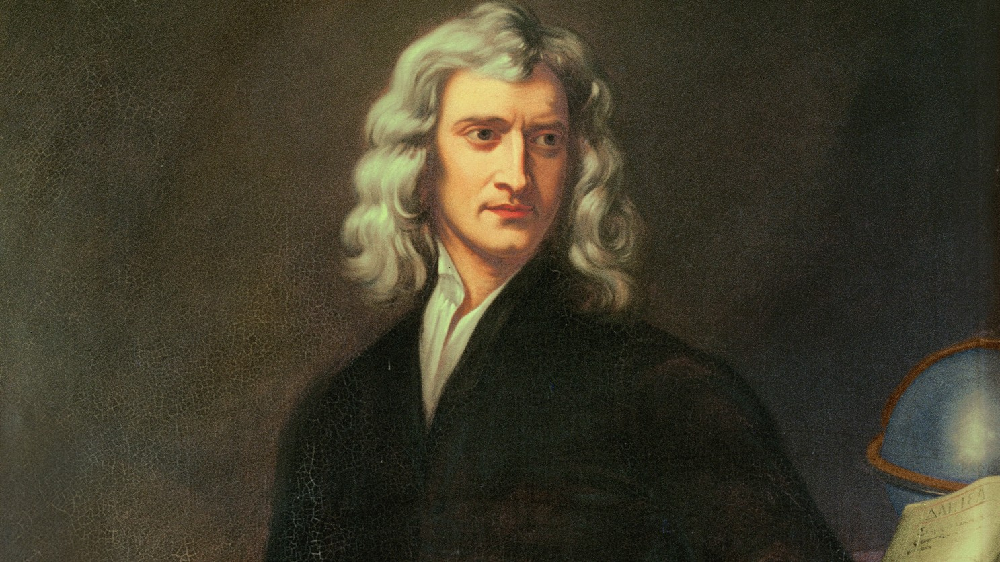
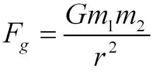
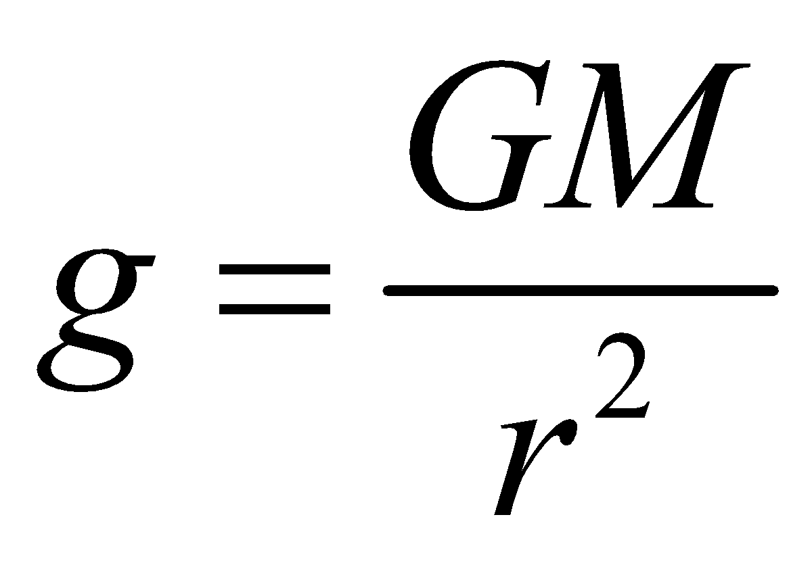

# The cosmic slingshot

**Group Member**

- Sakti Cahya Buana (22/503237/TK/54974)
- Deren Tanaphan (22/503261/TK/54976)

## Table of Contents

- [github](#github)
- [LinkedIn](#linkedin)
- [Instagram](#instagram)
- [Why this project?](#why-this-project)
- [Supporting Theory](#supporting-theory)
- [Modelling System](#modelling-system)
  - [Stochastic Aspect](#stochastic-aspect)
  - [Source Code](#source-code)
  - [Library Imports and Initialization](#library-imports-and-initialization) 
  - [Background and Object Initialization](#background-and-object-initialization)
  - [Object Class Methods](#object-class-methods)
  - [Asteroid Class Methods](#asteroid-class-methods)
  - [Simulation Functions](#simulation-functions)
  - [Main Function](#main-function)
- [Simulation Results](#simulation-results)
- [Analysis & Summary](#analysis-summary)
- [Reference](#reference)

## **Github** <a name="github"><a/>

https://github.com/Lev1reG/Gravitational-Slingshot-Simulation

## **LinkedIn** <a name="linkedin"><a/>

## **Instagram** <a name="instagram"><a/>

---

## Why this project? <a name="why-this-project"><a/>

The vast outer space is a whole new world yet to fully mapped. They’re not just vast, but holds a lot of mystery. Sending human into space is not just costly, but it’s extremely hard. Even a miniscule miscalculation could lead to a fatal disaster. This leads to the importance of simulation. Having simulation will make people study how the universe works. 

This project will simulate how planet’s gravitational force works using pygame. The simulation will demonstrate how planet’s gravitational force affects asteroid’s trajectory nearby. Moreover, the simulation will also demonstrate how black hole affects nearby object’s trajectory.

## Supporting Theory <a name="supporting-theory"><a/>

The base of this project is using the Newton’s law of universal gravitation.



“every particle attracts every other particle in the universe with a force that is proportional to the product of their masses and inversely proportional to the square of the distance between their centers.”

The formula for the gravitational force is:



Where:

- F = Gravitational force between two masses
- G = Gravitational constant (6.67 x 10^-11)
- m1 & m2 = Masses of two objects
- r = Distance between two objects

This formula can be derived to get the gravitational acceleration from:

F = m . a

a = F / m

Thus, we will get:

Where:

g = Gravitational acceleration



From these formulas, we can calculate and simulate the acceleration for each asteroid movements.

## Modelling System <a name="modelling-system"><a/>

### Stochastic Aspect <a name="stochastic-aspect"><a/>

In this project, stochastic elements are incorporated using a uniform distribution, which is implemented in Python via the `random` package. The `ASTEROID_RADIUS` is determined by generating a random integer between 10 and 20 using `randint`. Similarly, `MAX_ASTEROIDS` (the total number of asteroids) is generated as a random integer within the range of 50 to 100. The mass of each asteroid (`ASTEROID_MASS`) and their initial velocities are also generated using random numbers to introduce variability and realism into the simulation.

### Source Code <a name="source-code"><a/>

```python
# Import all necessary library for the project
import math
import random as rd
import pygame

# Initialize pygame
pygame.init()

# Set the desired window size for the pygame simulation
WIDTH, HEIGHT = 1920, 1200
win = pygame.display.set_mode((WIDTH, HEIGHT))
pygame.display.set_caption("Gravitational Slingshot Effect Simulation")

# Set the constants for the simulation
G = 6 * 10**-5   # Gravitational constant
FPS = 60   # Frame rate
VEL_SCALE = 10   # Velocity scale
ASTEROID_RADIUS = rd.randint(10, 20)   # Range of the generated asteroid radius

# Initialize the simulation background and asteroid image
BG = pygame.transform.scale(pygame.image.load("background.jpg"), (WIDTH, HEIGHT))
ASTEROID = pygame.transform.scale(
    pygame.image.load("asteroid.png"), (ASTEROID_RADIUS, ASTEROID_RADIUS)
)

class Object:
		# Initialize objects used
    def __init__(self, x, y, MASS, OBJECT_NAME, OBJECT_RADIUS):
        self.x = x   # X-coordinate of the object
        self.y = y   # y-coordinate of the object
        self.MASS = MASS   # Mass of the object
        self.OBJECT_RADIUS = OBJECT_RADIUS   # Radius of the object
        self.OBJECT_NAME = OBJECT_NAME   # Name of the object
        # Load and scale the image of the object
        self.OBJECT = pygame.transform.scale(
            pygame.image.load(self.OBJECT_NAME + ".png"),
            (self.OBJECT_RADIUS * 2, self.OBJECT_RADIUS * 2),
        )
        self.MAX_ASTEROIDS = rd.randint(50, 100)

    # Draw the object on the screen
    def draw(self):
        win.blit(
            self.OBJECT, (self.x - self.OBJECT_RADIUS, self.y - self.OBJECT_RADIUS)
        )
		# Simulate the gravitational interactions
    def simulate(self, MAX_ASTEROID_MASS, MIN_ASTEROID_VEL, MAX_ASTEROID_VEL):
        running = True
        clock = pygame.time.Clock()
				 
				 # Create a planet instance of the object
        planet = Object(
            WIDTH // 2, HEIGHT // 2, self.MASS, self.OBJECT_NAME, self.OBJECT_RADIUS
        )
        objects = []   # List to hold asteroid objects
        done_adding_asteroids = False

        while running:
            clock.tick(FPS)

            for event in pygame.event.get():
                if event.type == pygame.QUIT:
                    running = False
									
									# Add asteroids if not already added
                while not done_adding_asteroids:
                    for i in range(1, self.MAX_ASTEROIDS):
                        obj = Asteroid(MAX_ASTEROID_MASS)
                        obj.set_velocity(MIN_ASTEROID_VEL, MAX_ASTEROID_VEL)
                        objects.append(obj)
                    done_adding_asteroids = True

            win.blit(BG, (0, 0))   # Draw the background

            for obj in objects[:]:
                obj.draw()   # Draw the asteroid
                obj.move(planet)   # Move the asteroid
                # Move the asteroid
                off_screen = obj.x < 0 or obj.x > WIDTH or obj.y < 0 or obj.y > HEIGHT
                # Check if asteroid collided with the planet
                collided = (
                    math.sqrt((obj.x - planet.x) ** 2 + (obj.y - planet.y) ** 2)
                    <= self.OBJECT_RADIUS
                )
                # Remove asteroid if off screen or collided
                if off_screen or collided:
                    objects.remove(obj)

            planet.draw()   # Draw the planet
            pygame.display.update()   # Update the display
        pygame.quit()   # Quit the game

class Asteroid:
		# Initialize asteroid with random position and mass
    def __init__(self, MAX_MASS):
        self.x = rd.randint(0, WIDTH)  # Random X-coordinate
        self.y = rd.randint(0, HEIGHT)  # Random Y-coordinate
        self.MASS = rd.randint(1, MAX_MASS)  # Random mass

    # Set the velocity of the asteroid
    def set_velocity(self, min_vel, max_vel):
        self.vel_x = rd.randint(min_vel, max_vel)
        self.vel_x /= VEL_SCALE
        self.vel_y = rd.randint(min_vel, max_vel)
        self.vel_y /= VEL_SCALE

    # Move the asteroid based on gravitational force
    def move(self, planet):
        distance = math.sqrt((self.x - planet.x) ** 2 + (self.y - planet.y) ** 2)
        force = (G * self.MASS * planet.MASS) / distanceAsteroid radius**2
        acceleration = force / self.MASS
        angle = math.atan2(planet.y - self.y, planet.x - self.x)

        acceleration_x = acceleration * math.cos(angle)
        acceleration_y = acceleration * math.sin(angle)

        self.vel_x += acceleration_x
        self.vel_y += acceleration_y

        self.x += self.vel_x
        self.y += self.vel_y

     # Draw the asteroid on the screen
    def draw(self):
        win.blit(ASTEROID, (int(self.x), int(self.y)))

# Simulate the gravitational effect with Uranus
def uranus():
    MAX_ASTEROID_MASS = 6
    MIN_ASTEROID_VEL = -50
    MAX_ASTEROID_VEL = 50
    OBJECT_MASS = 100
    OBJECT_RADIUS = 70
    uranus = Object(WIDTH // 2, HEIGHT // 2, OBJECT_MASS, "uranus", OBJECT_RADIUS)
    uranus.simulate(MAX_ASTEROID_MASS, MIN_ASTEROID_VEL, MAX_ASTEROID_VEL)

# Simulate the gravitational effect with a black hole
def black_hole():
    MAX_ASTEROID_MASS = 6   # Set asteroid mass
    MIN_ASTEROID_VEL = -50   # Set minimum asteroid initial velocity
    MAX_ASTEROID_VEL = 50   # Set maximum asteroid initial velocity
    OBJECT_MASS = 100000000   # Set Object mass (planet or others)
    OBJECT_RADIUS = 100   # Set Object radius (planet or others)
    blackhole = Object(WIDTH // 2, HEIGHT // 2, OBJECT_MASS, "blackhole", OBJECT_RADIUS)
    blackhole.simulate(MAX_ASTEROID_MASS, MIN_ASTEROID_VEL, MAX_ASTEROID_VEL)

def main():
    # uranus()
    black_hole()
    
if __name__ == "__main__":
    main()
```

### **Library Imports and Initialization** <a name="library-imports-and-initialization"><a/>

- Imports necessary libraries: `math`, `random`, and `pygame`.
- Initializes Pygame and sets up the display window with dimensions 1920x1200 pixels.
- Defines constants including gravitational constant (`G`), frame rate (`FPS`), velocity scale (`VEL_SCALE`), and asteroid radius.

### **Background and Object Initialization** <a name="background-and-object-initialization"><a/>

- Loads and scales background and asteroid images.
- Defines the `Object` class representing celestial objects (e.g., planets, black holes), initializing their properties such as position, mass, radius, and image.
- Defines the `Asteroid` class representing asteroids, initializing their properties such as position, mass, and velocity.

### **Object Class Methods** <a name="object-class-methods"><a/>

- `draw()`: Draws the object on the screen.
- `simulate()`: Simulates the gravitational interactions, creating and updating asteroid movements, detecting collisions, and updating the display.

## **Asteroid Class Methods** <a name="asteroid-class-methods"><a

- `set_velocity()`: Sets the initial velocity of the asteroid.
- `move()`: Calculates the gravitational force exerted by a planet on the asteroid, updates the asteroid's velocity and position based on this force, and moves the asteroid accordingly.
- `draw()`: Draws the asteroid on the screen.

### **Simulation Functions** <a name="simulation-functions"><a/>

- `uranus()`: Sets up a simulation with Uranus as the central object, specifying parameters like asteroid mass and velocity ranges, and object mass and radius.
- `black_hole()`: Similar to `uranus()`, but with a black hole as the central object, using much larger mass and radius values.

### **Main Function** <a name="main-function"><a/>

- Runs the `black_hole()` or `uranus()` simulation when executed.

## Simulation Results <a name="simulation-results"><a/>

[](assets/uranus_simulation.mov)

[](assets/blackhole_simulation.mov)

## Analysis & Summary <a name="analysis-summary"><a/>

The project demonstrates the principles of gravitational forces and their impact on other celestial objects (in this case are asteroids) using Pygame simulation. Mass and radius of both objects defines the trajectory of the asteroids. The asteroid’s initial velocity and direction also affects the asteroid’s trajectory. This is why some asteroids collided into the planet or black hole and some asteroids orbiting it.

## Reference <a name="reference"><a/>

[](https://www.youtube.com/embed/HTfwhmHVpqM?si=Ro5wKs0lktcx8uVO)
